# Algorithmic Execution Engine

A Rust system for executing large orders over time. A client submits a **parent order**, for example *buy 100,000 units over the next hour*. The engine turns it into a schedule of **child orders** using one of several execution algorithms, and sends each child to a simulated limit order book. It also keeps exact positions and P&L, enforces pre-trade risk limits and a loss kill switch, and streams fills back over gRPC as they happen. A desktop client and Python bindings are built on top.

The project addresses the question that comes *after* a trading decision has been made: how to execute it. It contains no alpha model and makes no prediction about prices. The problem it solves is the one execution desks face every day: trading a large quantity without paying too much for liquidity and without carrying too much price risk while doing so.

| Layer | What it provides |
| --- | --- |
| Order book | Price-time priority matching on integer prices, with GTC, IOC and FOK orders |
| Algorithms | TWAP, randomized TWAP, VWAP, POV and Almgren-Chriss implementation shortfall, as pure functions |
| Engine | A deterministic state machine with exact `i128` accounting, pre-trade risk checks and a loss kill switch |
| Transport | A gRPC API (tonic) served by a single-owner async task, with streamed fills and graceful shutdown |
| Clients | An egui desktop client and a PyO3 Python package with a small backtest harness |
| Verification | 188 Rust tests (unit, property, differential, scenario, end-to-end) run in CI on Linux and Windows, and 77 Python cases run in CI on Linux under CPython 3.9 and 3.13 |

---

## Contents

1. [Why execution algorithms exist](#1-why-execution-algorithms-exist)
2. [System architecture](#2-system-architecture)
3. [Foundations: prices, quantities and time](#3-foundations-prices-quantities-and-time)
4. [The limit order book](#4-the-limit-order-book)
5. [Execution algorithms](#5-execution-algorithms)
6. [The execution engine](#6-the-execution-engine)
7. [The gRPC API](#7-the-grpc-api)
8. [Desktop client](#8-desktop-client)
9. [Python bindings and backtest harness](#9-python-bindings-and-backtest-harness)
10. [Verification](#10-verification)
11. [Performance](#11-performance)
12. [Limitations and scope](#12-limitations-and-scope)
13. [Getting started](#13-getting-started)
14. [Repository layout](#14-repository-layout)
15. [References](#15-references)
16. [License](#16-license)

---

## 1. Why execution algorithms exist

### The cost of demanding liquidity

A limit order book holds resting orders at discrete price levels. An order that trades immediately consumes them from the best price outward. If the ask side offers sizes $`s_1, s_2, \dots`$ at prices $`p_1 < p_2 < \dots`$, a market buy for $`Q \le \sum_i s_i`$ units pays an average of

```math
\bar{P}(Q) \;=\; \frac{1}{Q} \sum_{i} p_i \cdot \min\!\Big(s_i,\; \max\big(0,\; Q - \textstyle\sum_{j<i} s_j\big)\Big)
```

Once the depth at the best price is used up, each further level costs more than the one before it, so the average price paid rises with the size of the order. With 20,000 units at 100.50, 30,000 at 101.00, 40,000 at 101.50 and 50,000 at 102.00, a single order for 100,000 units averages **101.20**, about 70 basis points above the best ask. One sixth of the same order, 16,667 units, fits entirely at the best ask.

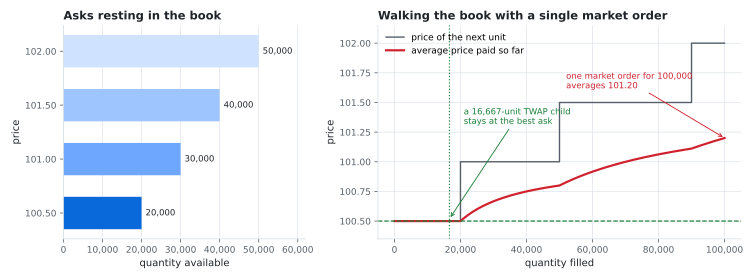

### Two costs that pull in opposite directions

Splitting the order and trading it gradually lets the book refill between trades, so each child pays less for liquidity. The price of that patience is **timing risk**: the unexecuted remainder is exposed to the market moving while the order waits.

```text
            trade quickly                                  trade slowly
  impact cost   high   <------------------------------------->   low
  timing risk   low    <------------------------------------->   high
```

Every execution algorithm is a policy for resolving this trade-off:

| Algorithm | Decides how much to trade from | Attitude to the trade-off |
| --- | --- | --- |
| TWAP | the clock | ignores risk, spreads impact evenly in time |
| VWAP | a forecast of when volume trades | spreads impact in proportion to expected liquidity |
| POV | volume actually observed | caps the order's share of the market, accepts that it may finish at any point in its window or not at all |
| Implementation shortfall | an explicit cost and risk model | minimizes expected cost plus a penalty on its variance |

### How execution quality is measured

Execution cost is reported as **shortfall** against the arrival price, the mid price at the moment the order was accepted, measured on the quantity that actually filled. Unlike full implementation shortfall, it carries no opportunity cost for the unfilled remainder of a cancelled or expired order. For an average fill price $`\bar{P}`$ and arrival mid $`M_0`$,

```math
\text{shortfall}_{\text{bps}} \;=\; d \cdot \frac{\bar{P} - M_0}{M_0} \cdot 10^4, \qquad d = \begin{cases} +1 & \text{buy} \\ -1 & \text{sell} \end{cases}
```

A positive value means the execution was worse than arrival: paying more on a buy, or receiving less on a sell. The engine reports this in `GetOrderStatus` for every parent order that has at least one fill, and leaves it unset for an order with no fills.

---

## 2. System architecture

### Runtime view

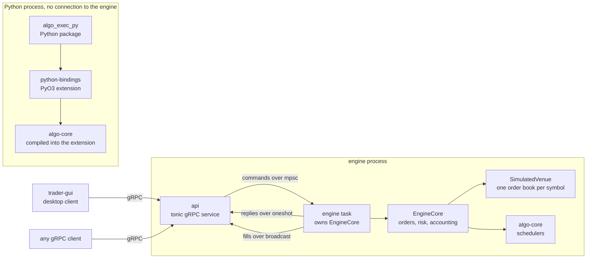

### Crates

| Crate | Responsibility | Depends on (workspace crates) |
| --- | --- | --- |
| [`orderbook`](crates/orderbook) | Limit order book, matching, and the `Price`, `Quantity`, `Timestamp` and `OrderId` types | none |
| [`algo-core`](crates/algo-core) | TWAP, randomized TWAP, VWAP, POV and implementation shortfall schedulers | none |
| [`api`](crates/api) | gRPC code generated from [`proto/execution.proto`](proto/execution.proto), the tonic service and the command types shared with the engine | `orderbook` |
| [`config`](crates/config) | TOML settings with unknown keys rejected and invalid values reported with the field named | none |
| [`engine`](crates/engine) | `EngineCore` state machine, risk limits, accounting, the simulated venue, the async task and the server binary | `orderbook`, `algo-core`, `api`, `config` |
| [`python-bindings`](crates/python-bindings) | PyO3 extension, installed as `algo_exec_py._native` | `orderbook`, `algo-core` |
| [`trader-gui`](crates/trader-gui) | egui desktop client that talks to the engine over gRPC | `orderbook`, `api` |

### Lifecycle of an order

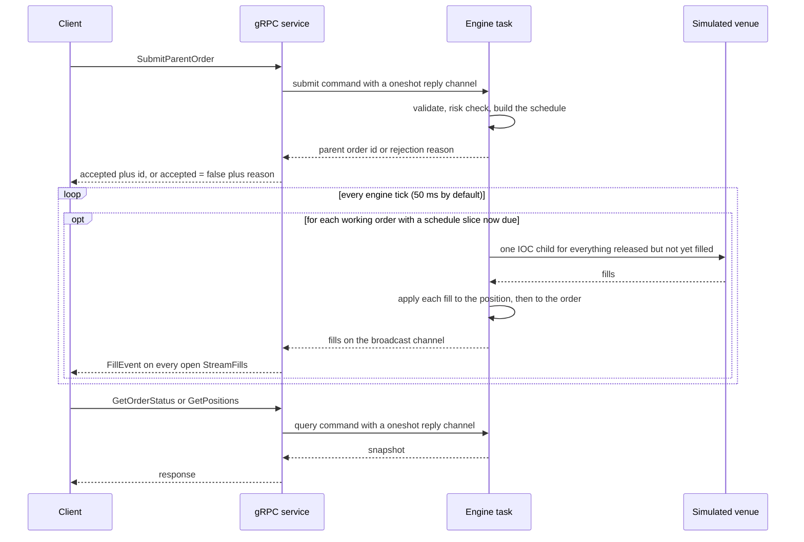

### Design principles

1. **A deterministic core with the clock at the edge.** `EngineCore` never reads a clock. The methods whose behavior depends on time, `submit` and `tick`, take the current time as an argument, and only the async wrapper in [`event_loop.rs`](crates/engine/src/event_loop.rs) reads the wall clock. The same commands with the same timestamps therefore produce the same child orders, fills and P&L on a given build and platform, and every engine scenario can be tested exactly.
2. **Integers for prices and money.** Prices are `i64` tick counts, quantities are `u64`, positions are `i64`, and cost basis, P&L and notional amounts are `i128`. Floating point appears only at the boundaries (user input, reported averages and shortfall, display) and inside the VWAP and Almgren-Chriss schedulers, whose outputs are rounded to integer quantities.
3. **One owner of state.** A single task owns all engine state, and the gRPC layer reaches it only through messages. There are no locks and no shared mutable state.
4. **Algorithms as validated pure functions.** Schedulers take plain parameters, return `Result`, and never panic on bad input.
5. **Layers that can be tested in isolation.** Algorithms can be tested without a clock, the engine without a network and the API without the GUI.

---

## 3. Foundations: prices, quantities and time

### Fixed-point prices

A `Price` is an `i64` count of ticks, with `Price::TICK_SCALE = 100_000.0` ticks per price unit (five decimal places). Comparing prices and looking up a level are exact integer operations.

Converting a decimal price to ticks rounds `price * 100000.0`, evaluated in `f64`, half away from zero. Rounding rather than truncating is essential: `0.29 * 100000.0` evaluates to `28999.999999999996`, which truncation would turn into the wrong tick.

**Exactness bound.** Take a price $`p`$ with at most five decimals, so its true tick count $`m = 10^5 p`$ is an integer, and let $`\hat{p}`$ be the nearest `f64` to $`p`$ (what a TOML or Python literal gives). Two rounding errors separate $`m`$ from the computed product $`\hat{x}`$, the `f64` result of $`10^5 \cdot \hat{p}`$: one from parsing the decimal, one from the multiplication. Writing $`\mathrm{ulp}(y)`$ for the spacing of `f64` values at $`y`$, every price below $`2^{35}`$ (about $`3.44 \times 10^{10}`$) satisfies

```math
|\hat{x} - m| \;\le\; \underbrace{10^5 \cdot \tfrac{1}{2}\,\mathrm{ulp}(\hat{p})}_{\le\; 10^5 \cdot 2^{-19} \;\approx\; 0.19} \;+\; \underbrace{\tfrac{1}{2}\,\mathrm{ulp}(\hat{x})}_{\le\; 0.25} \;<\; \tfrac{1}{2}
```

Rounding therefore recovers $`m`$ exactly for every tick count below $`10^5 \cdot 2^{35} \approx 3.44 \times 10^{15}`$. For larger prices the parsing error can reach about 0.38 tick and the result can be off by one. Testing agrees: random samples find no errors below $`10^5 \cdot 2^{35}`$ ticks, a scan finds the first error at $`10^5 \cdot 2^{35} + 2`$ ticks, and about 17% of prices between $`10^5 \cdot 2^{35}`$ and $`2^{52}`$ ticks are off by one tick. `Price::try_from_f64` rejects NaN, infinities and any price whose rounded tick count is not strictly between $`-2^{63}`$ and $`2^{63}`$ (prices beyond about $`9.22 \times 10^{13}`$ in magnitude), so it is the conversion to use for untrusted input.

### Quantities, positions and money

| Quantity | Type | Unit |
| --- | --- | --- |
| Order and fill quantity | `u64` | units |
| Position | `i64` | units, positive long, negative short |
| Cost basis, P&L, notional | `i128` (`TickValue`) | ticks × units |
| Timestamp | `u64` | nanoseconds since the Unix epoch |

`i128` holds the product of any `u64` quantity and any `i64` price, so the value of a single fill always fits. Where a sum could in principle exceed that range, position accounting uses checked arithmetic and reports an overflow instead of recording the fill, while P&L and notional totals saturate at the `i128` bounds. Realized and unrealized P&L sent over gRPC are clamped to the `int64` range. The mid price is $`\lfloor (\text{bid} + \text{ask}) / 2 \rfloor`$ ticks.

---

## 4. The limit order book

Source: [`crates/orderbook/src/book.rs`](crates/orderbook/src/book.rs)

### Structure

```text
OrderBook
├── bids:  BTreeMap<Price, Level>            best bid = highest key
│     100.00000 -> Level { total_qty: 45, orders: [#3 qty 25, #7 qty 20] }
│      99.50000 -> Level { total_qty: 35, orders: [#1 qty 35] }
├── asks:  BTreeMap<Price, Level>            best ask = lowest key
│     100.50000 -> Level { total_qty: 20, orders: [#4 qty 20] }
│     101.00000 -> Level { total_qty: 30, orders: [#2 qty 10, #9 qty 20] }
└── index: HashMap<OrderId, (Side, Price)>   resting id -> where it rests
```

Each level is a FIFO queue (`VecDeque`) with a cached total. The index lets a cancel go straight to the right level instead of searching the book.

### Matching rules

- A trade executes at the **resting (maker) order's price**.
- The best price level fills first; within a level, the earliest order fills first.
- A partially filled resting order **keeps its place** in the queue.
- A market order (no limit price) accepts any price and must be IOC or FOK.

### Time in force

| TIF | Unfilled remainder |
| --- | --- |
| GTC | rests in the book at its limit price |
| IOC | is cancelled after trading whatever is available |
| FOK | is never left: the full quantity trades immediately, or the order is killed before anything trades and the book is unchanged |

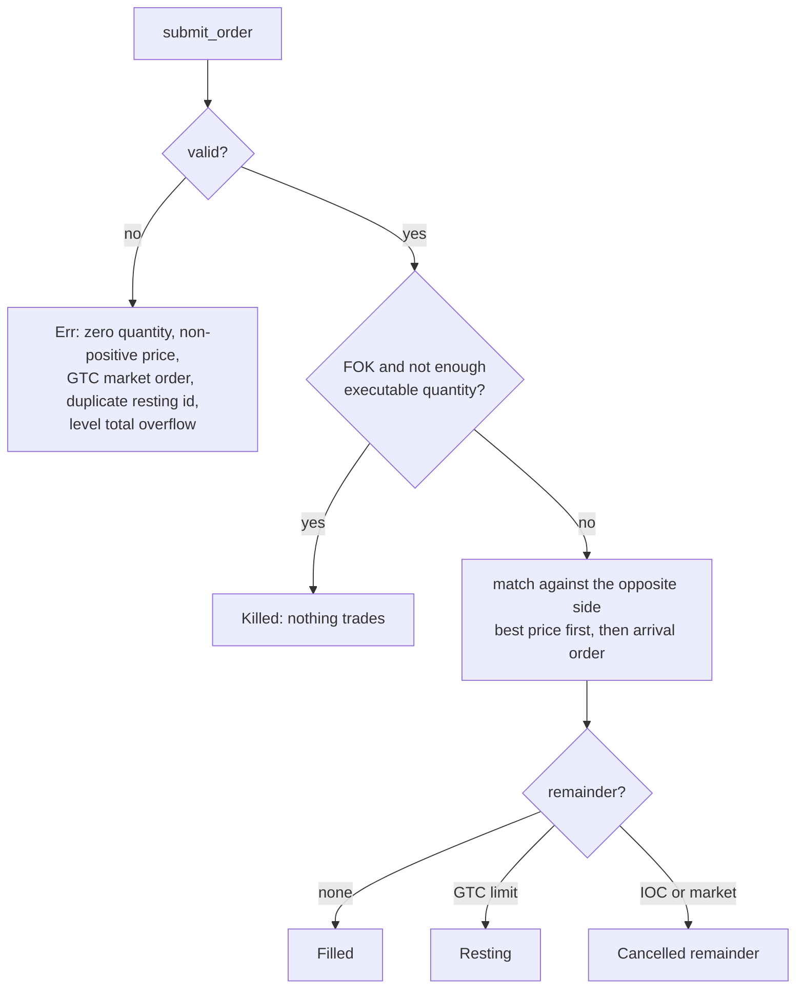

An order id must be unique among *resting* orders; the id of an order that has filled or been cancelled can be reused.

### Invariants

`check_invariants()` walks the whole book in expected $`O(n)`$ time for $`n`$ resting orders and verifies that:

- every level has a positive price and at least one order;
- no id rests twice;
- every cached level total equals the sum of its orders;
- the index matches the resting orders exactly;
- every resting order is a GTC limit order with a positive quantity, on the correct side and level;
- the book is not crossed.

The unit tests call it after every order the book accepts, and the differential test calls it after every submit and cancel.

### Complexity

With $`L`$ price levels on a side and $`k`$ orders at one level (index operations are expected and amortized because the index is a hash map):

| Operation | Cost |
| --- | --- |
| `submit_order` | $`O(\log L)`$ per level touched, plus expected amortized $`O(1)`$ per order filled or rested |
| `cancel_order` | expected $`O(1)`$ index lookup, $`O(\log L)`$ level lookup, $`O(k)`$ scan within the level |
| `best_bid`, `best_ask` | $`O(\log L)`$ |

---

## 5. Execution algorithms

Source: [`crates/algo-core/src`](crates/algo-core/src)

### 5.1 The shared contract

Every scheduler maps a window $`[t_{\text{start}}, t_{\text{end}})`$, a total quantity $`X`$ and algorithm parameters to a list of child orders `(target_time_ns, qty)`. The guarantees are common to all of them:

- quantities are positive integers, and they sum **exactly** to $`X`$ (POV sums to what the observed volume allows and reports the rest as `shortfall_qty`);
- invalid input returns a `ScheduleError`, never a panic;
- for the time-sliced schedulers (TWAP, VWAP and implementation shortfall), at most 1,000,000 slices, and every slice at least 1 ns long.

Time-sliced schedulers cut the window of length $`D`$ into $`N`$ slices whose lengths differ by at most one nanosecond:

```math
t_k \;=\; t_{\text{start}} + \Big\lfloor \frac{k\,D}{N} \Big\rfloor, \qquad k = 0, 1, \dots, N
```

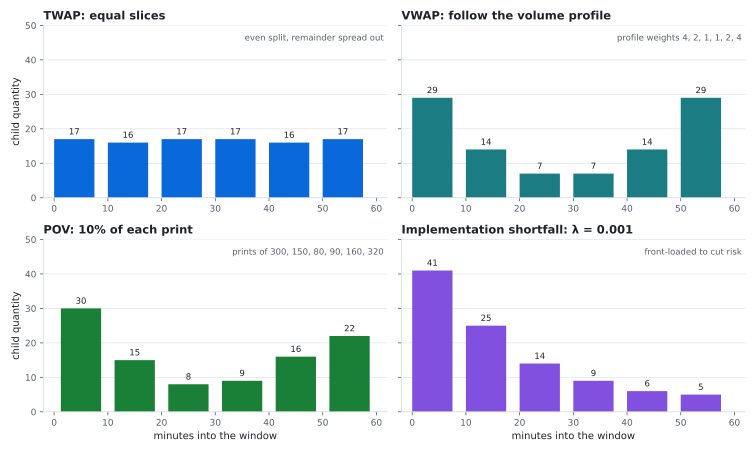

The chart shows 100 units over one hour. TWAP gives 17, 16, 17, 17, 16, 17. VWAP, with profile weights 4, 2, 1, 1, 2, 4, gives 29, 14, 7, 7, 14, 29. POV at 10% of prints of 300, 150, 80, 90, 160 and 320, arriving at minutes 5, 15, 25, 35, 45 and 55, gives 30, 15, 8, 9, 16, 22, where the last child is capped by the order size. Implementation shortfall with $`\lambda = 0.001`$ and the model parameters of section 5.6 ($`\sigma = 0.02`$, $`\eta = 0.5`$, $`\gamma = 10^{-6}`$) gives 41, 25, 14, 9, 6, 5.

### 5.2 TWAP: time-weighted average price

TWAP trades an equal share of the order in each time slice. The subtle part is rounding. Giving the remainder to the first slices front-loads the order, which works against the even pacing TWAP exists to provide. Instead, the **cumulative** target is rounded, and child quantities are its differences:

```math
C_k \;=\; \Big\lfloor \frac{X\,k}{N} + \frac{1}{2} \Big\rfloor, \qquad q_k \;=\; C_{k+1} - C_k, \qquad k = 0, \dots, N-1
```

Because each $`C_k`$ is within half a unit of the ideal straight line $`Xk/N`$, every prefix of the schedule is within half a unit of ideal. Each child is either $`\lfloor X/N \rfloor`$ or $`\lceil X/N \rceil`$, and the remainder is spread across the window. To avoid overflow at any size, the code writes $`X = aN + r`$ and evaluates, in `u128`,

```math
C_k \;=\; a\,k + \Big\lfloor \frac{r\,k}{N} \Big\rfloor + \big[\, 2\,(r\,k \bmod N) \ge N \,\big]
```

A test schedules `u64::MAX` units over 1,000,000 slices and checks the total is exact.

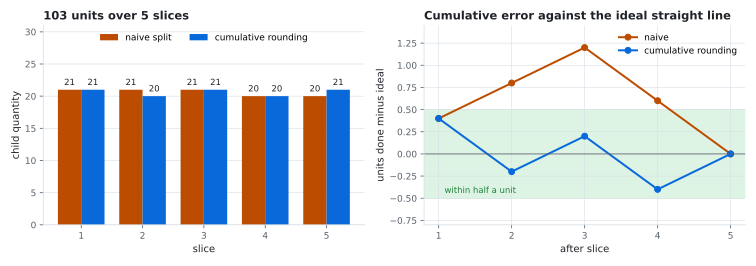

For 103 units over 5 slices, the naive split 21, 21, 21, 20, 20 drifts 1.2 units ahead of the ideal line. Cumulative rounding gives 21, 20, 21, 20, 21 and never strays more than half a unit.

### 5.3 Randomized TWAP

A child released at the exact start of every slice is easy to detect. Randomized TWAP keeps TWAP's quantities but releases each child at a pseudo-random time inside its own slice:

```math
s_k \;=\; t_k + \Big\lfloor \frac{u_k \cdot w_k}{2^{64}} \Big\rfloor, \qquad w_k = t_{k+1} - t_k
```

Here $`u_k`$ is the $`k`$-th output of SplitMix64 seeded by the caller. The multiply-shift reduction maps a uniform 64-bit value onto $`[0, w_k)`$, and each offset's probability is within $`2^{-64}`$ of $`1/w_k`$.

Two properties are deliberate:

- **Reproducible.** The same seed gives the same schedule on every platform. SplitMix64's output is fixed by its definition, and a test pins its first output for seed 0, `0xE220A8397B1DCDAF`, which Java's `SplittableRandom(0)` also produces.
- **Quantity-independent timing.** One draw is consumed per slice, including slices whose quantity rounds to zero. Slice $`k`$'s release time therefore depends only on the seed, the window and $`N`$, never on the order size.

SplitMix64 is not a cryptographic generator. The randomization defeats a fixed-clock observer, but it does not hide the schedule from a determined one. Anyone who learns the seed can reproduce every release time, and the release times themselves leak the seed: each reveals the top bits of a generator output, so an observer who knows the window and the slice count and sees the exact release times of two children can recover the seed with a short search.

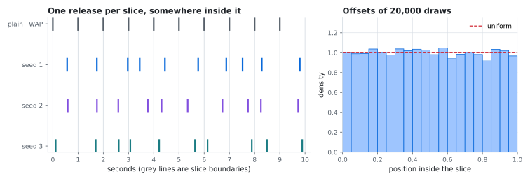

The histogram pools 20,000 draws (200 seeds × 100 slices), and their offsets inside the slice are flat, as a uniform distribution should be.

### 5.4 VWAP: volume-weighted average price

**Intuition.** Suppose each slice $`k`$ trades market volume $`v_k`$, out of a total $`V`$, at a volume-weighted average price $`p_k`$. An order that trades the same share of each slice's volume, $`q_k = X \, v_k / V`$, and fills at each slice's average price achieves exactly the market's VWAP:

```math
\bar{P}_{\text{order}} \;=\; \frac{\sum_k q_k\,p_k}{X} \;=\; \frac{\sum_k v_k\,p_k}{V} \;=\; \text{VWAP}_{\text{market}}
```

Future volume is unknown, so the schedule follows a **forecast** profile $`w_0, \dots, w_{N-1}`$ estimated from history. Tracking error against the realized VWAP comes mainly from the forecast being wrong. Smaller contributions come from releasing each slice's quantity as one child at a single instant, which fills at that moment's prices rather than at the slice's average price, and from rounding quantities to whole units.

**Schedule.** With cumulative shares $`S_k = \sum_{j \le k} w_j / \sum_j w_j`$, the cumulative target after slice $`k`$ is $`\mathrm{round}(X\,S_k)`$. It is clamped to be non-decreasing, and the last slice with volume completes $`X`$ exactly. The curve stops at that slice instead of being forced to 1 afterwards. Above $`2^{53}`$ not every integer is representable as an `f64`, so for some totals the rounded target falls short of the total, and forcing the curve would hand that leftover to a trailing zero-volume slice. Truncating it guarantees a slice with no forecast volume never receives a child. Weights may be on any scale; the code divides by the largest weight so the running sum stays finite even for weights near `f64::MAX`.

**Estimating the profile.** `volume_profile_from_bars` pools historical bars by time of day across days. A bar at offset $`o`$ into a window of length $`D`$ belongs to slice

```math
\mathrm{slice}(o) \;=\; \Big\lfloor \frac{(o+1)\,N - 1}{D} \Big\rfloor, \qquad \mathrm{slice}(o) = k \;\Longleftrightarrow\; \Big\lfloor \frac{kD}{N} \Big\rfloor \;\le\; o \;<\; \Big\lfloor \frac{(k+1)D}{N} \Big\rfloor \qquad (0 \le o < D)
```

These are exactly the boundaries the schedulers use, so each bar's volume goes to the slice that contains its timestamp, which for this function marks the start of the bar. The simpler $`\lfloor oN/D \rfloor`$ can place a bar one slice early: for a 10 ns window in 3 slices, bars at offsets 3 and 6 would land in slices 0 and 1 instead of 1 and 2. Each slice's fraction is its pooled volume over the pooled window volume, so busier days weigh more. Only bars from before the day being traded should be used, since that day's own volume would be look-ahead.

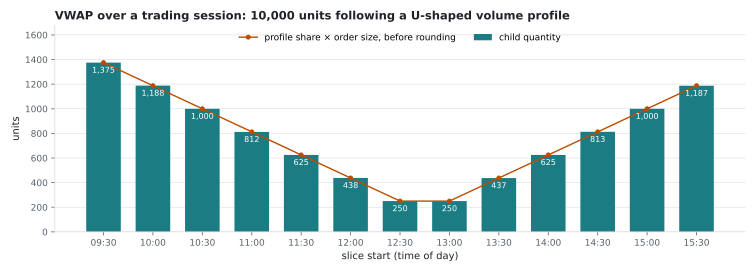

### 5.5 POV: percentage of volume

POV participates at a fixed rate $`\rho`$ (in basis points) of the volume that actually prints. Each observation $`j`$ reports the volume traded since the previous one. With $`V_j`$ the cumulative in-window volume after observation $`j`$, the cumulative target and the child released at $`t_j`$ are

```math
C_j \;=\; \min\!\Big(X,\; \Big\lfloor \frac{\rho \cdot V_j}{10\,000} \Big\rfloor\Big), \qquad \text{child}_j \;=\; C_j - C_{j-1}, \qquad C_0 = 0
```

A child is released only when this increase is positive. The arithmetic is exact in `u128`, so $`10\,000 \cdot C_j \le \rho \cdot V_j`$ holds for every prefix, exactly and not approximately. Observations that share a timestamp form one decision point and one child. If the volume never arrives, the untraded quantity is reported as `shortfall_qty` rather than dropped.

A child is released at the timestamp of the observation that allowed it, so the timestamps must mark when volume became **known**: a bar's close, not its open. Passing bar opens would build look-ahead into the schedule, and the function cannot detect that.

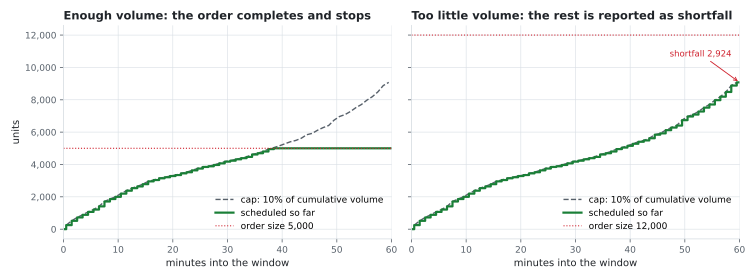

The chart runs two orders at 10% participation against one simulated hour of prints. A 5,000-unit order completes at the print 38.5 minutes into the window and stops. A 12,000-unit order meets a window volume of 90,767, so it schedules $`\lfloor 9076.7 \rfloor = 9{,}076`$ units and reports a shortfall of 2,924.

POV is available from the library and Python but not from the engine API: the simulated venue publishes no volume feed for a participation rate to track.

### 5.6 Implementation shortfall: the Almgren-Chriss model

Implementation shortfall is the only algorithm here that is an **optimization** rather than a rule. It follows the discrete model of Almgren and Chriss (2000).

#### The model

Trade $`X`$ units over $`N`$ slices of length $`\tau`$ (horizon $`T = N\tau`$). Let $`x_k`$ be the holdings still to trade at $`t_k = k\tau`$, with $`x_0 = X`$ and $`x_N = 0`$, and let $`n_k = x_{k-1} - x_k`$ be the quantity traded in slice $`k`$. The model has three ingredients:

| Effect | Model | Parameter |
| --- | --- | --- |
| Permanent impact | each unit traded moves the price by $`\gamma`$ for good | $`\gamma`$, price per unit |
| Temporary impact | trading at rate $`n_k/\tau`$ costs $`\eta\,n_k/\tau`$ per unit, in that slice only | $`\eta`$, price per (unit per second) |
| Volatility | the unaffected price is an arithmetic random walk | $`\sigma`$, price per $`\sqrt{\text{second}}`$ |

The shortfall of a trajectory is a random variable with mean $`E`$ and variance $`V`$:

```math
E \;=\; \tfrac{1}{2}\gamma X^2 \;+\; \frac{\tilde{\eta}}{\tau}\sum_{k=1}^{N} n_k^2, \qquad \tilde{\eta} = \eta - \tfrac{1}{2}\gamma\tau
\qquad\qquad
V \;=\; \sigma^2\,\tau \sum_{k=1}^{N} x_k^2
```

- **Permanent impact** contributes $`\tfrac{1}{2}\gamma X^2 - \tfrac{1}{2}\gamma\sum n_k^2`$. The first part is the same for every trajectory, so it cannot be optimized away, and the second is absorbed into $`\tilde{\eta}`$.
- **Trading-rate cost** $`(\tilde{\eta}/\tau)\sum n_k^2`$, temporary impact plus the split-dependent part of permanent impact, is convex, so for a fixed total it is smallest when trades are equal and grows quadratically as trading is concentrated.
- **Risk** $`V`$ is the variance of the shortfall, which comes from price moves on the units still held, so it is smallest when the order is finished quickly.

The fixed spread cost is omitted: it adds the same amount to every one-directional trajectory, so it does not change the optimum.

#### The optimal trajectory

For a risk aversion $`\lambda \ge 0`$, the scheduler minimizes $`U = E + \lambda V`$. Because $`\tilde{\eta} > 0`$, $`U`$ is a strictly convex quadratic in the interior holdings, so its unique minimum is where every partial derivative vanishes. Setting $`\partial U / \partial x_k = 0`$ gives a linear second-order difference equation:

```math
\frac{x_{k-1} - 2x_k + x_{k+1}}{\tau^2} \;=\; \tilde{\kappa}^2\, x_k, \qquad \tilde{\kappa}^2 = \frac{\lambda\,\sigma^2}{\tilde{\eta}}
```

The left side is a discrete second derivative, so the holdings must curve in proportion to themselves. The solutions are combinations of $`e^{\pm\kappa t}`$, and the boundary conditions $`x_0 = X`$, $`x_N = 0`$ select

```math
x_k \;=\; X\,\frac{\sinh\!\big(\kappa\,(T - t_k)\big)}{\sinh(\kappa T)}, \qquad \frac{2}{\tau^2}\big(\cosh(\kappa\tau) - 1\big) \;=\; \tilde{\kappa}^2
```

**Reading the result.**

- $`\kappa`$ is the **urgency**, with units of 1/time, and $`1/\kappa`$ is the time scale on which holdings decay.
- **Risk-neutral** ($`\lambda = 0`$): $`\kappa = 0`$, the sinh ratio becomes the straight line $`(T - t_k)/T`$, and the schedule is TWAP. The code uses TWAP's integer rounding in this case, and a test checks the children are identical to TWAP's for every slice count from 1 to 39 against 203 order sizes.
- **Small** $`\kappa T`$: the trajectory is nearly linear.
- **Large** $`\kappa T`$: holdings decay roughly like $`X e^{-\kappa t}`$ and the order is front-loaded.
- **Fine slices** ($`\tau \to 0`$): $`\tilde{\eta} \to \eta`$ and $`\kappa \to \sqrt{\lambda\sigma^2/\eta}`$, the square root of risk aversion times variance rate over temporary impact. At a fixed $`\tau`$, $`\kappa`$ differs from $`\tilde{\kappa} = \sqrt{\lambda\sigma^2/\tilde{\eta}}`$ only at order $`\tilde{\kappa}^3\tau^2`$.

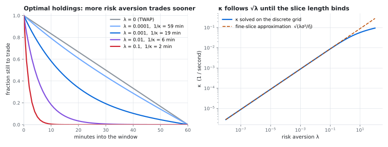

#### Worked numbers

The table uses 100,000 units over one hour in 60 one-minute slices, with $`\sigma = 0.02`$, $`\eta = 0.5`$, $`\gamma = 10^{-6}`$ (so $`\tilde{\eta} = 0.49997`$). The $`\sqrt{\lambda\sigma^2/\tilde{\eta}}`$ column is evaluated from its formula for comparison; every other column is `almgren_chriss_schedule` output ($`\kappa`$, first child, $`E`$) or derived directly from it ($`1/\kappa`$, holdings after 30 minutes, $`\sqrt{V}`$):

| $`\lambda`$ | $`\kappa`$ (1/s) | $`\sqrt{\lambda\sigma^2/\tilde{\eta}}`$ | $`1/\kappa`$ | first child | held after 30 min | $`E`$ | $`\sqrt{V}`$ |
| --- | --- | --- | --- | --- | --- | --- | --- |
| 0 | 0 | 0 | infinite | 1,667 | 50.0% | 1,393,806 | 68,415 |
| 0.0001 | 0.000283 | 0.000283 | 58.9 min | 2,192 | 44.2% | 1,421,314 | 64,059 |
| 0.001 | 0.000894 | 0.000894 | 18.6 min | 5,242 | 19.2% | 2,293,506 | 45,601 |
| 0.01 | 0.002825 | 0.002829 | 5.9 min | 15,592 | 0.6% | 7,050,536 | 24,386 |
| 0.1 | 0.008841 | 0.008945 | 1.9 min | 41,165 | 0.0% | 21,601,019 | 11,272 |

Three things stand out:

- **Fine-slice approximation.** For $`\lambda \le 0.001`$ the discrete $`\kappa`$ is within 0.02% of $`\tilde{\kappa} = \sqrt{\lambda\sigma^2/\tilde{\eta}}`$. As urgency grows, the one-minute slice starts to bind: at $`\lambda = 0.1`$, $`\kappa`$ is 1.2% below $`\tilde{\kappa}`$.
- **Doing better than TWAP on the objective.** At $`\lambda = 0.001`$ the optimal schedule's objective $`E + \lambda V`$ is 4,372,928, against 6,074,472 for TWAP, 28% lower. It pays 65% more expected impact to cut the standard deviation of cost by a third.
- **Rounding.** At $`\lambda = 0.1`$ the order is essentially complete after 21 slices: the children at minutes 0 to 20 carry 99,999 of the 100,000 units, the last unit goes at minute 23, and the 38 slices that round to zero are omitted, leaving 22 children.

#### The efficient frontier

Sweeping $`\lambda`$ traces the set of trajectories for which no other trajectory has both lower expected cost and lower variance. TWAP sits at one end, with the lowest expected cost and the most risk.

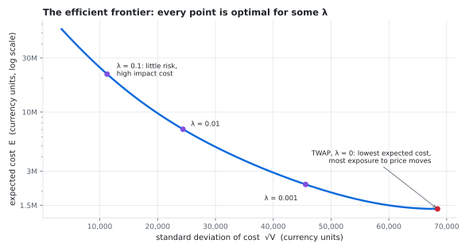

#### Numerical care

The closed form is simple on paper, but three places need care in floating point, and each has a test at the extreme:

- **Tiny urgency.** $`\kappa\tau = \mathrm{acosh}(1 + y)`$ with $`y = \tilde{\kappa}^2\tau^2/2`$. For tiny $`y`$, `1 + y` rounds to exactly 1 and `acosh` returns 0, which would silently turn the schedule into TWAP. The code evaluates $`\kappa\tau = \mathrm{ln1p}\big(y + \sqrt{y(y+2)}\big)`$, which keeps the $`\sqrt{2y}`$ behavior. For large $`y`$ it factors $`y`$ out of the square root so the product cannot overflow.
- **Huge urgency.** At high $`\kappa T`$, `sinh` overflows and the ratio becomes `inf/inf`. The code evaluates it as $`e^{-\kappa t}\,\frac{\mathrm{expm1}(-2\kappa(T-t))}{\mathrm{expm1}(-2\kappa T)}`$, which stays finite for $`\lambda`$ as large as $`10^{200}`$.
- **Degenerate inputs.** $`\tilde{\eta} \le 0`$ is rejected, because the model divides by it. The variance is computed as $`\tau\sum(\sigma x_k)^2`$ rather than $`\sigma^2\tau\sum x_k^2`$, so an overflowing $`\sigma^2`$ times a trajectory that holds nothing after its first slice gives 0 instead of `NaN`.

$`\sigma`$, $`\eta`$ and $`\gamma`$ are inputs. The schedule is optimal *given* those parameters; estimating them from market data is outside this project.

---

## 6. The execution engine

Source: [`crates/engine/src`](crates/engine/src)

### 6.1 The state machine

`EngineCore` holds the simulated venue, the working parent orders and the most recently finished ones, positions, risk limits and the halt state. It changes only through `submit`, `cancel`, `tick` and `halt`, and it is read through `order_status` and `positions`. No method reads a clock: `submit` and `tick` take the current time as an argument, and the other calls do not depend on time.

### 6.2 Accepting a parent order

`submit` applies its checks in a fixed order and stops at the first failure, returning the reason:

1. trading is not halted;
2. the symbol is known;
3. the quantity is positive;
4. a limit price, if given, is positive;
5. the window has not already ended;
6. the book has a two-sided market, and its mid becomes the **arrival price**;
7. pre-trade risk checks pass (section 6.6);
8. the algorithm parameters produce a valid schedule.

### 6.3 Parent order lifecycle

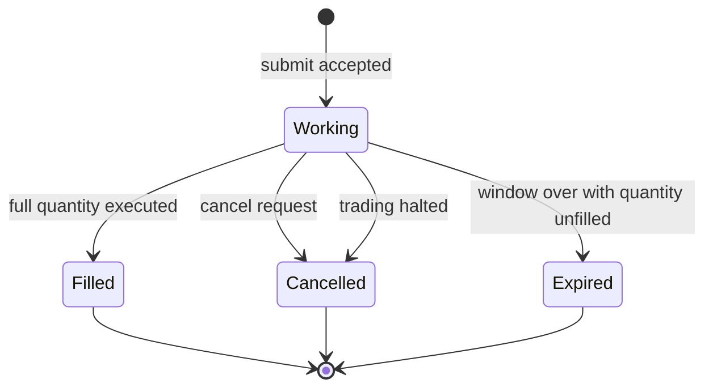

Only the most recent `retained_finished_orders` finished orders stay queryable. An older finished order is forgotten, and `GetOrderStatus` for it returns `NOT_FOUND`.

### 6.4 The tick

A timer drives `tick(now)` every `tick_interval_ms` (50 ms by default):

```text
tick(now):
    for each working parent order, in id order:
        stop if a fill has overflowed the accounting this tick
        release every schedule slice whose time is <= now
        if at least one slice was released:
            send one IOC child for (released - filled)      # includes carried quantity
            apply each fill to the position, then to the order,
                stopping at the first fill the position cannot take without overflow
            if everything has executed: mark the order Filled
        if the order is still working and now >= end of its window:
            finish it: Filled if everything executed, otherwise Expired
    retire finished orders
    refresh the market maker's quotes
    halt if a fill overflowed the accounting, or if total P&L <= -max_loss
```

Four behaviors follow from this loop:

- **Carry forward.** An IOC child that does not fill completely leaves its remainder unfilled, and the next child includes it. With one level of 60 units on each side, a 300-unit TWAP in three slices sends children of 100, 140 and 180, fills 60 each, and expires with "window ended with 120 of 300 unfilled".
- **Catch-up.** Several slices that come due between two ticks go out together as one child. Slices that no tick reached before the window end go out on the first tick at or after it. With ticks only at 0 s, 5 s and 10 s, a 100-unit TWAP over ten one-second slices sends 10, 50 and 40 and finishes Filled.
- **Honest timestamps.** A child is stamped with the tick time it was sent, not the time it was scheduled for.
- **Slicing pays off in this venue.** With five levels of 100 units spaced one basis point apart, a 500-unit order sent as one child averages 3 bps above the mid. The same order in five children averages 1 bp, because the book refills between ticks.

### 6.5 The simulated venue

Each symbol has its own order book, quoted by a market maker around a fixed reference price $`P_{\text{ref}}`$ (in ticks), with $`L`$ levels per side spaced $`b`$ basis points apart:

```math
\text{step} = \max\!\Big(1,\; \Big\lfloor \frac{P_{\text{ref}}\cdot b}{10\,000} \Big\rfloor\Big), \qquad
\text{ask}_i = P_{\text{ref}} + i\cdot\text{step}, \qquad \text{bid}_i = P_{\text{ref}} - i\cdot\text{step}, \qquad i = 1,\dots,L
```

Every level holds `qty_per_level` units. At the end of every tick the maker cancels its remaining quotes and posts a full ladder again, so the mid is always $`P_{\text{ref}}`$ between ticks.

Refreshing at the *end* of the tick is deliberate. Nothing trades between ticks, so children see the same book either way. But the loss check, and every query or submission until the next tick, then value positions against a full two-sided book rather than one that this tick's fills drained. Engine child order ids count up from 1, while market maker ids start at $`2^{63}`$, so the two can never collide.

### 6.6 Risk management

Pre-trade checks run on every new parent order. Let $`Q`$ be the order quantity, $`P_{\text{lim}}`$ its limit price (if any), $`M`$ the mid, $`x`$ the current position, and $`W^{\text{buy}}`$, $`W^{\text{sell}}`$ the unfilled quantity of working buy and sell orders in the symbol. The limits $`Q_{\max}`$, $`c_{\text{bps}}`$, $`N_{\max}`$, $`X_{\max}`$ and $`G_{\max}`$ are the `[risk]` settings `max_order_qty`, `price_collar_bps`, `max_order_notional`, `max_position_qty` and `max_gross_notional`:

| Check | Condition for acceptance |
| --- | --- |
| Order size | $`Q \le Q_{\max}`$ |
| Price collar (limit orders) | $`\lvert P_{\text{lim}} - M\rvert \cdot 10^4 \le c_{\text{bps}} \cdot M`$ |
| Order notional | $`Q \cdot \max(P_{\text{lim}}, M) \le N_{\max}`$, using $`M`$ for a market order |
| Position | buy: $`\lvert x + W^{\text{buy}} + Q\rvert \le X_{\max}`$; sell: $`\lvert x - W^{\text{sell}} - Q\rvert \le X_{\max}`$ |
| Gross exposure | $`G + Q \cdot M \le G_{\max}`$, where $`G = \sum_s \big(\lvert x_s\rvert + W^{\text{buy}}_s + W^{\text{sell}}_s\big)\,M_s`$ |

The position check assumes the new order and every working order on its side fill completely, so the limit holds whatever order the fills arrive in.

**Kill switch.** After every tick the engine marks all positions at the mid. If realized plus unrealized P&L is at or below $`-\text{max\_loss}`$, trading halts: every working order is cancelled, new orders are rejected with the reason, and `GetPositions` reports the halt. A fill that cannot be applied without arithmetic overflow halts trading the same way. A halt stops *new* risk; it does not liquidate existing positions, and it lasts until the engine restarts.

### 6.7 Exact accounting

Each symbol's position uses average-cost accounting in integers. A fill in the position's direction adds to the quantity and the cost basis. A fill against it first closes open quantity, realizing P&L against the average cost, and any excess opens a position in the other direction:

```text
short 5 at 100, then buy 10 at 90
    the first 5 close the short:   realized P&L += 5 × (100 - 90) = +50
    the next 5 open a long:        quantity = +5, cost basis = 450, average 90
```

The design rests on one identity, which holds after every fill:

```math
\text{realized P\&L} \;-\; \text{cost basis} \;=\; \text{net cash} \;=\; \sum_{\text{sells}} q\,p \;-\; \sum_{\text{buys}} q\,p
```

**Why it holds.**

- **Opening $`q`$ at price $`p`$:** the cost basis and net cash both move by $`q\,p`$ in opposite senses, and realized P&L is unchanged.
- **Closing $`c`$ units at price $`p`$:** realized P&L gains the signed closing value $`\mathrm{sgn}(x)\,c\,p`$ minus the removed cost, and the cost basis loses the removed cost. Their difference therefore moves by exactly $`\mathrm{sgn}(x)\,c\,p`$, which is the change in net cash.

Unrealized P&L is $`x \cdot \text{mark} - \text{cost basis}`$, so total P&L is $`\text{net cash} + x \cdot \text{mark}`$: plain mark-to-market, exact in integers. Only the split between realized and unrealized P&L carries rounding, from truncating the cost removed on a partial close. A property test applies random fill sequences of up to 199 fills and checks the identity after every fill. When $`c`$ of $`o`$ open units close, the cost removed is $`\mathrm{trunc}(B\,c/o)`$ for cost basis $`B`$. The code splits $`B`$ into its whole and remainder parts relative to $`o`$ and scales each separately. This gives the same integer without forming the product $`B\,c`$, which could overflow even when the result fits.

### 6.8 Concurrency and shutdown

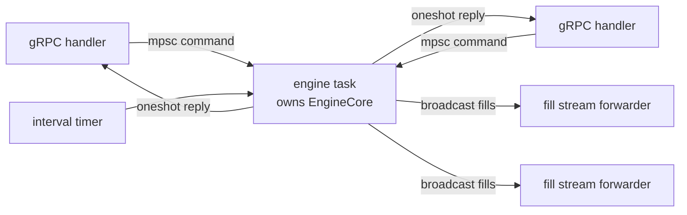

- **One owner.** The engine task owns `EngineCore`. Handlers send a command carrying a fresh oneshot channel and await the reply, so engine state is never shared and the engine's own code takes no locks.
- **Missed ticks are skipped**, not replayed in a burst.
- **Slow subscribers.** Fills fan out on a broadcast channel. A subscriber that falls more than about `fill_buffer` fills behind (tokio rounds the capacity up to a power of two, and each stream buffers up to 256 more) receives `DATA_LOSS` with an instruction to resubscribe and reconcile with `GetOrderStatus`. A forwarder stops as soon as its client disconnects.
- **Shutdown order.** A graceful gRPC shutdown waits for open streams to finish, and while its client stays connected and keeps up, a fill stream only finishes when the engine stops. `engine::serve` therefore stops the engine *as part of* the shutdown signal, before the server drains. An end-to-end test holds a `StreamFills` stream open through shutdown and checks the server exits.

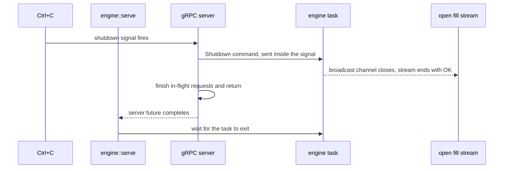

---

## 7. The gRPC API

Schema: [`proto/execution.proto`](proto/execution.proto). Prices are integer ticks, quantities integer units, timestamps Unix epoch nanoseconds, and P&L ticks × units (clamped to `int64` on the wire). Algorithm parameters use a `oneof`, and values that can be absent use `optional` fields: the limit price, an order's average fill price and shortfall, and a position's average price, unrealized P&L and mark price. A few fields still rely on proto3 zero values: `parent_order_id` is 0 on a rejection, an empty `symbol` in `GetPositions` requests every symbol, and a `start_time_ns` of 0 is treated as unset and rejected.

| RPC | Returns |
| --- | --- |
| `SubmitParentOrder` | `accepted` and a parent order id, or `accepted = false` and a reason |
| `CancelParentOrder` | whether the order was cancelled, or why not |
| `GetOrderStatus` | state and reason, filled quantity, arrival mid, average fill price, shortfall in bps, pending slices, window, and every child order |
| `GetPositions` | for each symbol that has had a fill (or only the one requested): quantity, average price, realized P&L, and the mark price and unrealized P&L when there is a two-sided market; plus whether trading has halted and why |
| `StreamFills` | a server stream of every fill from the moment of subscription |

Algorithms offered through the API: TWAP (`num_slices`), VWAP (`volume_profile`) and implementation shortfall (`num_slices`, `risk_aversion`, `volatility`, `temporary_impact`, `permanent_impact`, with time in seconds).

### Error model

The API separates a **business answer** from a **failed call**, so a client can tell an answer it should show to a user from a call that failed:

| Situation | Result |
| --- | --- |
| Halted, unknown symbol, zero quantity, non-positive limit, window over, no two-sided market, risk limit, invalid schedule | the call succeeds with `accepted = false` and a reason |
| Unknown, finished or no longer retained id on cancel | the call succeeds with `cancelled = false` and a reason |
| Side not BUY or SELL, no algorithm, `start_time_ns` unset | `INVALID_ARGUMENT` |
| Unknown or no longer retained id on `GetOrderStatus` | `NOT_FOUND` |
| Engine not running | `UNAVAILABLE` |
| Fill subscriber too far behind | the stream ends with `DATA_LOSS` |
| Engine shut down | the fill stream ends with `OK` |

`start_time_ns = 0` is rejected because proto3 delivers an omitted field as zero, which would place the window in 1970 and make every slice due at once.

---

## 8. Desktop client

Source: [`crates/trader-gui/src/main.rs`](crates/trader-gui/src/main.rs)

An egui application that acts as a thin client. Every order, position and fill it shows comes from an engine reply, except that an order the engine no longer recognizes is marked UNKNOWN by the client. It has four pages:

| Page | Contents |
| --- | --- |
| Orders | order entry for TWAP, VWAP and implementation shortfall; a table of submitted orders with their shortfall; a detail panel with the limit, window, state reason, pending slices, child orders and a cancel button |
| Positions | quantity, average price, realized and unrealized P&L and mark per symbol |
| Fills | the live fill stream and a fill price chart for a selected symbol |
| Connection | engine address (default `127.0.0.1:50051`), connect and disconnect, and the client log |

A status bar along the bottom of the window shows the connection state and, in red, whether trading has halted and why. The client does not connect automatically; connect from the Connection page. It is built to stay correct when the engine is slow, restarted or unreachable:

- **Sessions.** Each connection is a session. Connecting or disconnecting clears the orders, positions, fills and halt status the previous session showed (the log is kept), and a session generation number discards replies and fills that arrive late from an old connection.
- **Deadlines.** Every unary request has a 5-second deadline, and connecting times out after 3 seconds. The fill stream subscription has no deadline; a new session stops it instead.
- **Backpressure.** At most one positions poll and one order status poll are in flight at a time. Polling stops for an order the engine no longer knows, and the fill stream resubscribes with backoff.
- **Honest status.** The connection indicator follows reachability, so an order rejection does not mark the engine as down.
- **Input checks.** Limit prices are converted to ticks, and an execution window that would overflow the clock is rejected before sending.

The only local values are the three quick-fill symbol buttons (the API has no call to list symbols), the form defaults, the order start time (taken from this machine's clock at submission), the UNKNOWN state the client assigns to an order the engine no longer recognizes, and log times.

---

## 9. Python bindings and backtest harness

Source: [`crates/python-bindings`](crates/python-bindings), [`python/`](python)

A PyO3 extension built with maturin. The `algo_exec_py` package ships with the compiled module inside it as `algo_exec_py._native` and re-exports its functions. Supported CPython versions are 3.9 to 3.13 (`requires-python = ">=3.9,<3.14"`): 3.13 is the newest version PyO3 0.22 supports, and 3.9 is the oldest version CI tests.

```python
import algo_exec_py as ae

HOUR = 3_600_000_000_000
DAY = 86_400_000_000_000
OPEN = 9 * HOUR + 30 * 60_000_000_000        # 09:30
SESSION = 6 * HOUR + 30 * 60_000_000_000     # 6.5 hours

# lists of (target_time_ns, qty)
ae.twap_schedule(start_ns=0, end_ns=10_000_000_000, total_qty=1_000, num_slices=10)
ae.twap_schedule_randomized(0, 10_000_000_000, 1_000, 10, seed=42)

# a profile from five days of 30-minute bars, then a schedule that follows it
bars = [(day * DAY + OPEN + m * 60_000_000_000, 1_000 + 40 * abs(195 - m))
        for day in range(5) for m in range(0, 390, 30)]
profile = ae.volume_profile_from_bars(bars, OPEN, SESSION, 13)
ae.vwap_schedule(0, SESSION, 10_000, profile)

# dict with children, scheduled_qty, shortfall_qty
ae.pov_schedule(0, 1_000, 10_000, 1_000, [(1, 500), (2, 500)])

# dict with children, holdings, kappa, expected_cost, cost_variance
ae.almgren_chriss_schedule(
    start_ns=0, end_ns=HOUR, total_qty=100_000, num_slices=12,
    risk_aversion=1e-3, volatility=0.02, temporary_impact=0.5, permanent_impact=1e-6,
)

ae.price_to_ticks(0.29)   # 29000
```

**Exceptions.** Arguments are converted to Rust types before any scheduler runs, so the exception depends on how an argument is wrong:

| Argument problem | Exception |
| --- | --- |
| Wrong type | `TypeError` (a tuple of the wrong length, such as a three-element bar, raises `ValueError` from the conversion instead) |
| Integer outside its parameter's range, for example a negative quantity | `OverflowError` |
| Value the Rust code rejects: a schedule or profile input, or a price that is NaN, infinite or outside the tick range | `ValueError`, carrying the Rust error message |

**Backtest harness.** `algo_exec_py.backtest.BacktestEngine` replays a TWAP or randomized TWAP schedule against a recorded price path. Each child fills in full at the price linearly interpolated at its release time, clamped at the ends of the path. `calculate_metrics()` reports total quantity, notional, VWAP, the arrival price, shortfall in basis points and the number of fills. It is a no-impact, no-latency baseline that isolates how a schedule's timing interacts with price moves. For example, buying 1,000 units in 10 slices over 10 seconds while the price rises from 100 by 1.0 per second gives a VWAP of 104.5 and a shortfall of +450 bps; selling gives -450 bps.

---

## 10. Verification

### Test inventory

| Crate | Unit | Doc | Integration |
| --- | --- | --- | --- |
| `orderbook` | 38 | 1 | 1 differential test (512 random operation sequences) |
| `algo-core` | 59 | 5 | 0 |
| `engine` | 21 | 1 | 23 (21 deterministic scenarios, 2 end-to-end tests over gRPC) |
| `api` | 6 | 1 | 0 |
| `config` | 4 | 0 | 0 |
| `python-bindings` | 2 | 0 | 0 |
| `trader-gui` | 26 | 0 | 0 |
| **Total** | **156** | **8** | **24** |

Python: 38 test functions, 77 cases once parametrized.

### Techniques

- **Differential testing.** A deliberately naive second order book (a flat list with linear scans, no price levels, no index and no cached totals) replays random sequences of 1 to 79 submits and cancels alongside the real book. After every step the test compares execution reports, cancel results, full depth on both sides and the resting order count, and runs `check_invariants`. 512 sequences run per invocation.
- **Property-based testing** (proptest in Rust, Hypothesis in Python), for properties that must hold for every input:
  - the accounting identity;
  - exact schedule totals;
  - TWAP's half-unit prefix bound, checked exactly in integers;
  - VWAP's prefix bound;
  - POV's participation cap, completeness and prefix invariance;
  - that no small perturbation of the Almgren-Chriss trajectory lowers its objective.
- **Closed forms and known answers**, where the expected value comes from outside the implementation:
  - SplitMix64's first output for seed 0, which Java's `SplittableRandom(0)` independently produces;
  - the residual of the urgency equation for $`\kappa`$;
  - agreement with the textbook sinh formula;
  - the first-order optimality condition at every interior point;
  - the closed-form cost and variance of a linear trajectory;
  - $`\lambda = 0`$ matching the linear holdings $`X(1 - k/N)`$;
  - a pinned randomized schedule checked against an independent Python implementation of the generator.
- **Deterministic engine scenarios.** Because time is an argument, scenario tests assert exact prices, quantities and states. Examples include `identical_inputs_produce_identical_results`, `the_kill_switch_marks_losses_against_a_full_book`, `slices_no_tick_reached_go_out_when_the_window_ends` and `slicing_a_large_order_pays_less_than_trading_it_at_once`.
- **Corruption tests.** Private book state is corrupted in nine ways that `submit_order` and `cancel_order` can never produce, and `check_invariants` must report each one: a crossed book, a stale cached total, a missing index entry, a stale index entry, a duplicate id at two levels, a duplicate id that only the id check can catch, an empty level, a non-positive price, and a resting IOC order.
- **End-to-end tests.** Over a real loopback socket, one test submits an order, streams its fills, and reads status and positions. It then checks that a business rejection arrives in the response while a malformed request gets `INVALID_ARGUMENT` and an unknown id gets `NOT_FOUND`. A second test holds a fill stream open through shutdown.
- **Python parity.** The bindings are compared with independent pure-Python implementations where a definition is short enough to restate: TWAP rounding and slice starts, the randomized generator, the slice a volume bar falls in, and the Almgren-Chriss closed form. Otherwise they are checked against defining properties.

### Continuous integration

[`.github/workflows/ci.yml`](.github/workflows/ci.yml) runs on pushes to `main` and on pull requests:

- **Rust**, on Ubuntu and Windows: `cargo fmt --all --check`, `cargo clippy --workspace --all-targets --locked -- -D warnings`, then `cargo test --workspace --locked` in debug (integer overflow checks on) and again with `--release`.
- **Python**, on Ubuntu with CPython 3.9 and 3.13: build and install the package, then run pytest.

---

## 11. Performance

Criterion benchmarks of the order book on the `bench` profile (release with LTO, one codegen unit), single-threaded on one laptop. These measure book operations inside one process; they are not end-to-end latency figures for the engine or the API. Timings also depend on the machine's state: two idle runs on the same laptop differed by up to about 25%, and a run made while other heavy work was active was up to about 55% slower. For each operation the table reports the slower of the two idle runs, so read the figures as orders of magnitude rather than precise costs.

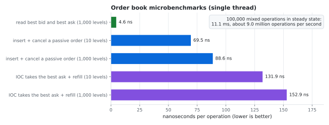

| Operation | Levels per side | Time |
| --- | --- | --- |
| Read best bid and best ask | 1,000 | 4.8 ns |
| Insert a passive limit order, then cancel it | 10 | 85.4 ns |
| Insert a passive limit order, then cancel it | 1,000 | 96.1 ns |
| IOC takes the best ask, then a passive order refills it | 10 | 131.9 ns |
| IOC takes the best ask, then a passive order refills it | 1,000 | 152.9 ns |
| 100,000 mixed operations in steady state | 100 | 11.1 ms, about 9.0 million operations per second |

Each per-operation benchmark restores the book to the same shape after every iteration, so the cost does not drift as it runs. The mixed workload is generated against a shadow copy of the book, so cancels name orders that are really resting and every IOC is priced at the live touch or up to two ticks through it, and trades. The add and cancel choice caps the resting count, and the benchmark asserts that the resting order count ends within 100 of its starting value, so the figure describes a steady state rather than a growing book.

With seed 7 the stream contains:

- 48,250 passive limit orders;
- 36,830 cancels;
- 14,920 IOC orders producing 20,956 fills.

The resting count moves from 800 to 899. These figures hold for the `rand` version pinned in `Cargo.lock`.

Run them with `cargo bench -p orderbook`.

---

## 12. Limitations and scope

The boundaries below are deliberate. Each is stated so the results above can be read correctly.

- **The market model is static.** The reference price never moves and the market maker is the only liquidity. Fills consume depth, which the quote refresh at the end of the same tick restores. Execution cost measured in the engine is the scheduler walking a static ladder, not market impact in a real market.
- **Almgren-Chriss parameters are supplied, not estimated.** Calibrating $`\sigma`$, $`\eta`$ and $`\gamma`$ from data is a separate problem.
- **Children go out on ticks.** A child is released on the first tick at or after its scheduled time, 50 ms apart by default. Slices still due when the window ends go out on the first tick at or after the end.
- **POV and randomized TWAP are not exposed through the engine API.** POV needs a volume feed, which the venue does not publish, and randomized TWAP is available only from the library and the Python bindings.
- **No exchange connectivity or market data.** There is no FIX, no venue adapter and no live feed.
- **No persistence.** Engine state lives in memory for the life of the process.
- **No authentication or TLS.** The shipped configuration binds to loopback for that reason.
- **The kill switch does not liquidate.** It cancels working orders and blocks new ones, and it lasts until restart.
- **No self-trade prevention.** The book has no notion of order ownership.
- **Determinism has a scope.** `EngineCore` is reproducible for identical inputs on a given build and platform. The Almgren-Chriss schedule uses libm exponentials, which are not guaranteed bit-identical across platforms, and the live server supplies wall-clock time, so live runs are not replayable.
- **Randomized TWAP is not cryptographically unpredictable.**
- **The backtest harness has no impact, latency, fees or queue position.**
- **Benchmarks are from one machine**, and there is no throughput claim for the engine or API as a whole.

---

## 13. Getting started

### Build and test

Requirements: a recent stable Rust toolchain and a CPython 3.9 to 3.13 interpreter on the `PATH`, because the workspace includes the PyO3 bindings, which link against libpython. `protoc` is vendored, so no system protobuf installation is needed. On Linux the GUI needs the usual X11 and xkbcommon development libraries; CI installs `libxcb-render0-dev libxcb-shape0-dev libxcb-xfixes0-dev libxkbcommon-dev libssl-dev`.

```bash
git clone https://github.com/shaunak-batra/RustAlgoExecutionSystem.git
cd RustAlgoExecutionSystem

cargo build --release
cargo test --workspace                       # 188 tests
cargo test --workspace --release
cargo clippy --workspace --all-targets -- -D warnings
```

### Run the engine and the client

From the repository root:

```bash
cargo run --release --bin engine                          # reads config/default.toml
cargo run --release --bin engine -- --config my.toml      # or another settings file
cargo run --release --bin trader-gui                      # then connect on the Connection page
```

Ctrl+C stops the engine, which ends every open fill stream; the server then finishes in-flight requests and exits.

### Configuration

Settings live in [`config/default.toml`](config/default.toml). Unknown keys are rejected, invalid values are reported with the offending field named, and money is written in price units and converted to ticks at startup, where an amount too large for the tick range is rejected (that error gives the value but not the field).

```toml
[engine]
tick_interval_ms = 50              # 1 to 60000
command_buffer = 1024              # 1 to 1000000
fill_buffer = 4096                 # 1 to 1000000
retained_finished_orders = 10000

[api]
listen_addr = "127.0.0.1:50051"    # no authentication, so loopback

[risk]
max_order_qty = 100000
max_order_notional = 10000000.0
max_position_qty = 500000
max_gross_notional = 50000000.0
price_collar_bps = 500             # 1 to 10000
max_loss = 250000.0

[[venue.symbols]]
symbol = "BTC-USD"
reference_price = 65000.0
levels = 20
qty_per_level = 5
level_spacing_bps = 1
```

Three simulated markets ship configured:

| Symbol | Reference price | Levels per side | Units per level | Spacing |
| --- | --- | --- | --- | --- |
| BTC-USD | 65,000 | 20 | 5 | 1 bp |
| ETH-USD | 3,500 | 20 | 50 | 1 bp |
| SIM-EQ | 100 | 10 | 5,000 | 2 bp |

### Python

```bash
pip install -r python/requirements.txt
pip install ./python
pytest python/tests -q                       # 77 cases
python python/algo_exec_py/backtest/engine.py   # small backtest demo
```

### Regenerate the charts

Every chart except the book walk and the benchmark chart is computed from the library through the Python bindings. The book walk is direct arithmetic over a fixed ladder of asks, and the benchmark chart plots the Criterion results from section 11:

```bash
pip install matplotlib
python docs/generate_charts.py               # writes docs/images/*.svg
```

---

## 14. Repository layout

```text
.
├── Cargo.toml                    workspace manifest and shared dependency versions
├── config/default.toml           engine settings
├── proto/execution.proto         gRPC schema
├── crates/
│   ├── orderbook/                matching engine, fixed-point types
│   │   ├── benches/              Criterion benchmarks
│   │   └── tests/                differential test against a reference book
│   ├── algo-core/                TWAP, VWAP, POV and implementation shortfall
│   ├── api/                      protobuf build, tonic service, engine command types
│   ├── config/                   settings loading and validation
│   ├── engine/
│   │   ├── src/executor.rs       EngineCore: submit, cancel, tick, halt
│   │   ├── src/state.rs          parent order lifecycle
│   │   ├── src/risk.rs           pre-trade limits and the loss check
│   │   ├── src/accounting.rs     exact position and P&L accounting
│   │   ├── src/venue.rs          simulated venue and market maker
│   │   ├── src/event_loop.rs     async task that owns EngineCore
│   │   ├── src/service.rs        engine task plus gRPC server, shutdown order
│   │   ├── src/main.rs           server binary
│   │   └── tests/                scenario and end-to-end tests
│   ├── python-bindings/          PyO3 extension
│   └── trader-gui/               egui desktop client
├── python/
│   ├── algo_exec_py/             Python package and backtest harness
│   └── tests/                    parity and property tests
├── docs/
│   ├── generate_charts.py        builds the README charts, most of them through the bindings
│   └── images/                   generated SVG charts
└── .github/workflows/ci.yml      continuous integration
```

---

## 15. References

- Almgren, R. and Chriss, N. (2000). "Optimal execution of portfolio transactions." *Journal of Risk* 3(2), 5-39. The implementation shortfall scheduler implements the discrete linear-impact model and closed-form trajectory from this paper.
- Steele, G. L., Jr., Lea, D. and Flood, C. H. (2014). "Fast splittable pseudorandom number generators." *OOPSLA 2014*, 453-472. Randomized release times use SplitMix64, the widely used `splitmix64.c` variant of the generator introduced in this paper.

---

## 16. License

MIT. See [LICENSE](LICENSE).
